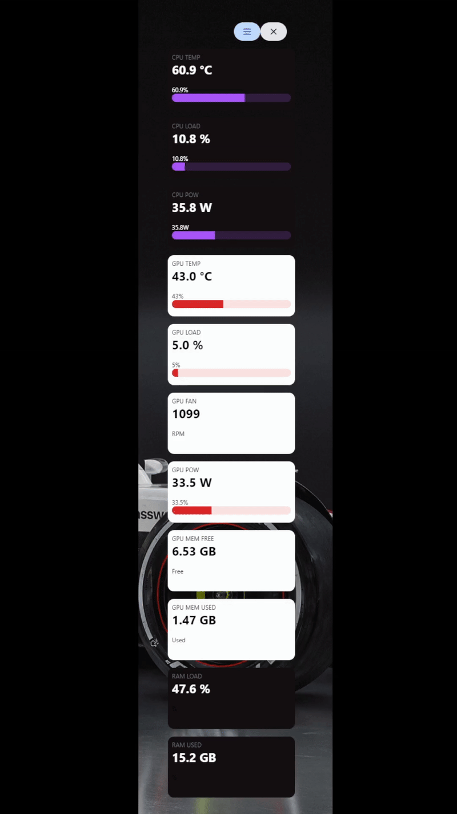

# 🖥️ Project Hub | System Resource Monitor

**Project Hub** is a lightweight, real-time dashboard that visualizes **CPU, GPU, and RAM usage** on your local machine. Built using **Tailwind CSS** for sleek styling and a custom **local API** powered by Hardware Monitor, it provides clear system insights at a glance.

> 📊 Designed for personal productivity, performance diagnostics, and developer desktops.

---

## 🌟 Features

- 📈 Real-time CPU, GPU, and RAM tracking
- ⚡ Fast, responsive UI built with Tailwind CSS
- 🧩 Custom integration with Hardware Monitor local API
- 🌓 Clean and modern dark-themed dashboard

---

## 🎯 Use Case

Ideal for developers, gamers, or tech enthusiasts who want a minimal system monitor without heavy apps. Project Hub sits in your browser as a local tool to give you essential performance stats quickly and beautifully.

---

## ⚙️ Tech Stack

| Technology     | Role                         |
|----------------|------------------------------|
| Tailwind CSS   | UI styling & responsiveness  |
| JavaScript     | Frontend logic & updates     |
| Local API      | System data (via HWMonitor)  |
| HTML/CSS       | Static structure & layout    |

---

## 📸 Screenshots

<p align="center">
  
</p>


---

```bash
Clone the Repository

git clone https://github.com/ImPewPew/Project-Hub.git
cd Project-Hub

npm install

Make Sure Hardware Monitor API is Running
Ensure your system is running the Hardware Monitor app that exposes data via a local API (e.g., localhost:xxxx). Adjust the endpoint in the code if needed.

npm start
```
---

##  🧠 How It Works
Periodic fetch requests poll the local API.

Tailwind-driven UI dynamically updates charts or stat cards.

Smooth, low-overhead visuals keep it lightweight and usable while multitasking.

---

✨ Author
Built with 💻 by Emmanuel B
Part of my personal developer toolkit and development portfolio.

---


